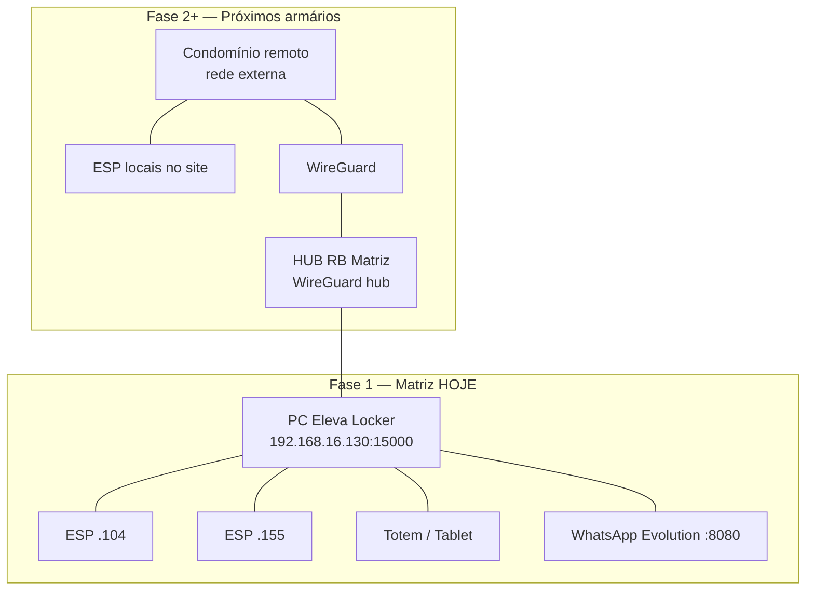

# Arquitetura de rede — fases de deploy

**Para:** Sandro / ELEVA  
**Decisão (set/2026):** Analisar bem **antes** de mudar URL pública, domínio ou sync das ESP.  
**Primeiro deploy:** Armário **ELEVA Locker Matriz** — tudo em **rede local**.

---

## Visão geral



---

## Fase 1 — Matriz (agora)

**Onde roda:** PC `C:\ElevaLocker` na LAN `192.168.16.0/24`.

| Componente | Rede | URL / IP |
|------------|------|----------|
| Painel admin | Local | `http://192.168.16.130:15000` |
| Totem Matriz (Fully) | Local | `http://192.168.16.130:15000/totem/2?kiosk=1` |
| ESP32 (.104, .155) | Local | Heartbeat/sync → `192.168.16.130:15000` |
| WhatsApp Evolution | Local | `http://192.168.16.130:8080` |
| Morador (WhatsApp) | Celular 4G/Wi‑Fi | **Sem link IP** — nome + endereço do armário |

### `.env` recomendado (Matriz — não mudar por enquanto)

```env
APP_URL_BASE=http://192.168.16.130:15000
ELEVA_PAINEL_URL=http://192.168.16.130:15000/dashboard
NOTIF_INCLUIR_LINK_TOTEM=0
TOTEM_ARMARIO_ID=2
ESP32_MODO_SIMULACAO=0
```

### O que **não** fazer na Fase 1

- ❌ Registrar domínio público **só por causa da Matriz**
- ❌ Mudar `APP_URL_BASE` para HTTPS externo
- ❌ Expor porta 15000 na internet
- ❌ Fazer ESP acessarem URL pública — ficam na **LAN local**

### O que **já** está certo para Fase 1

- WhatsApp com **nome + endereço** do armário (sem IP local na mensagem) — PR #44
- Totem + depósito + retirada na rede interna
- WireGuard pode existir no HUB para **outros fins** — Matriz ESP **não dependem** do túnel

---

## Fase 2+ — Próximos armários (rede externa)

**Cenário:** Armário em condomínio **fora** da LAN da Matriz (outro link, outro roteador).

**Princípios acordados:**

1. **ESP ficam locais** — IP `192.168.x.x` na rede **do condomínio**, cabo/Wi‑Fi no armário.
2. **Comunicação administrativa** Matriz ↔ site via **túnel WireGuard** (HUB RB).
3. **Servidor Eleva** — definir por instalação (ver modelos abaixo).

### Modelo A — Servidor local no condomínio (recomendado para offline-first)

| Item | Onde |
|------|------|
| Flask + SQLite/Postgres | Mini PC **no site** |
| ESP | LAN local do site → `http://IP_LOCAL_SITE:15000` |
| Túnel WG | Site → Matriz (backup, monitoramento, suporte) |
| `APP_URL_BASE` | IP **local do site** (ex. `http://192.168.1.10:15000`) |

**Vantagem:** Armário opera se internet cair; sync ESP não depende de Matriz.

### Modelo B — Servidor central na Matriz

| Item | Onde |
|------|------|
| Flask | Matriz `192.168.16.130` |
| ESP no site remoto | LAN local, mas API via **WireGuard** até Matriz |
| `APP_URL_BASE` | IP VPN ou IP Matriz **visível pelo túnel** |

**Atenção:** ESP precisam rota WG estável; mais fragile que Modelo A.

### Decisão pendente (antes de codar Fase 2)

- [ ] Modelo A ou B por instalação?
- [ ] Um Eleva Locker **por armário** ou multi-armário central?
- [ ] IP fixo do peer WireGuard por site (planilha peers)

---

## Fase 3 — Domínio público (quando fizer sentido)

**Não é prioridade para Matriz local.**

Usar domínio + HTTPS quando precisar:

- Morador abrir **link** no WhatsApp **de qualquer lugar** (não só ler endereço)
- Portal morador / cadastro / pagamento **fora** da rede do condomínio
- LGPD Fase 5 (HTTPS obrigatório em produção exposta)

Guia: `docs/DOMINIO_PUBLICO_PASSO_A_PASSO.md` — **aplicar só na Fase 3**.

Pode ser:

- Domínio na **Matriz** (um hub para todos), ou
- Domínio **por cliente** (futuro)

---

## Tabela resumo

| | Fase 1 Matriz | Fase 2 Site externo | Fase 3 Domínio |
|--|---------------|---------------------|----------------|
| Servidor | PC local .130 | Local no site **ou** Matriz+WG | HTTPS público |
| ESP | LAN .104/.155 | LAN no condomínio | LAN (igual) |
| Túnel WG | Opcional / HUB | **Sim** — site ↔ Matriz | Pode manter |
| WhatsApp link | Endereço texto | Endereço ou link* | Link https |
| `APP_URL_BASE` | IP local .130 | IP local do site | `https://dominio` |

\* Conforme config `NOTIF_INCLUIR_LINK_TOTEM` e se morador alcança URL.

---

## Checklist antes de qualquer alteração de rede

1. ☐ Este armário é **Matriz (Fase 1)** ou **site externo (Fase 2)**?
2. ☐ ESP estão na **mesma LAN** que o `APP_URL_BASE`?
3. ☐ Totem Fully usa URL **local** (não precisa domínio)?
4. ☐ WhatsApp: morador precisa **clicar link** ou só **ler endereço**?
5. ☐ WireGuard: peer cadastrado no HUB RB com IP fixo?

Se Matriz Fase 1 → **manter `.env` local**; não implementar domínio ainda.

---

## Próximos passos sugeridos (sem pressa)

1. **Concluir Matriz** — cadastro morador, depósito, retirada, WhatsApp (rede local).
2. **Documentar peers WireGuard** — template por condomínio (nome, IP WG, IP LAN ESP).
3. **Piloto Fase 2** — um condomínio com Modelo A (servidor local + túnel monitoramento).
4. **Fase 3** — domínio quando portal morador / pagamento externo forem prioridade.

---

*Atualizado em 02/09/2026 — revisar após primeiro deploy remoto.*
